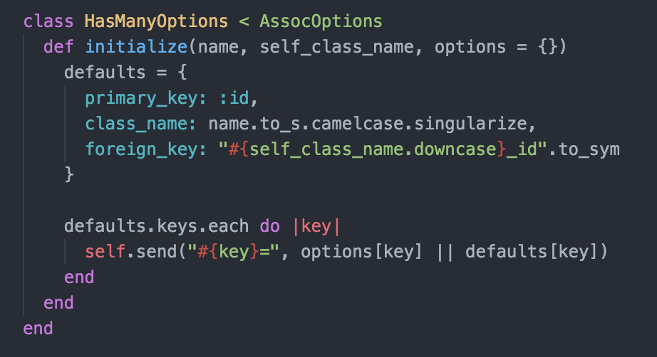
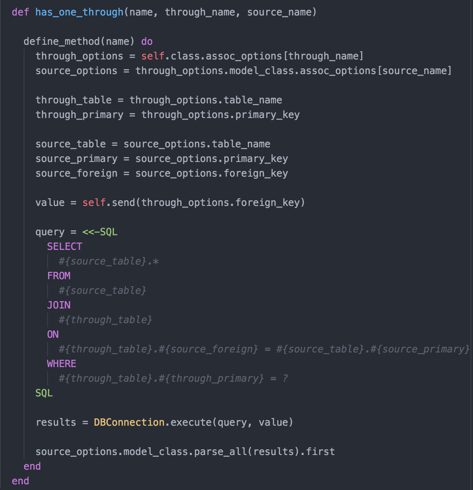

# Datafy

## Summary

A lightweight Object-Relational Mapping (ORM) library for Ruby based on Rail's
ActiveRecord.

Perform database operations in an object-oriented fashion while maintaining
readability and DRYness of your code.

##Demo

1. Clone the repo
2. cd Datafy
3. cat dragons.sql | sqlite3 dragons.db
3. Load `irb` or `pry` in terminal
4. Run `load './demo.rb'`

## Libraries

- SQLite3 (gem)
- ActiveSupport::Inflector

## Features

- Intuitive API for ease-of-use.
- Implements similar core functionality of ActiveRecord::Base
- Provides logical syntax and follows Ruby conventions.
- Follows the well-loved 'convention over configuration' mantra for naming
when setting associations. e.g Will search schema for "houses" table if "House"
class.
- Allows simple override of naming convention.

## API

SQLObject provides similar core ActiveRecord associations:

- `has_many`
- `belongs_to`
- `has_one_through`

SQLObject provides similar core ActiveRecord methods:

- `::find`
    - Finds item with given id
- `::where`
    - Finds all items with given criteria
- `::all`
    - Finds all items
- `::parse_all`
    - Take in an array and turns all items into table objects
- `::finalize!`
    - Defines #col and #col= methods on table
- `::columns`
    - Prints out a list of columns from given table
- `#save`
    - Saves changes that are made to table item
- `#insert`
    - Used by #save, inserts new item into end of table
- `#update`
    - Used by #save, updates item if it exists

### Insert/Update

<!-- [] -->

### Has Many Options (default values)
[]

### Has One Through
[]

## How It Works

A user provides a database file path to DBConnection, which accesses the database
through the SQLite3 gem. This is done through DBConnection::open(db_file_name)
which instantiates a singleton of SQLite3::Database.

DBConnection uses native SQLite3::Database methods as `#execute`, `#execute2`,
and `#last_insert_row_id` to allow Orb to perform SQL queries in the
form of heredocs.

SQLObject gives the user a plethora of ActiveRecord methods and association
methods which maps to SQL queries. The Associatable module extends SQLObject to
allow for associations such as `has_many`, `belongs_to`, `has_one_through` to be
made. These associations provide sensible default class_name, foreign_key, and
primary_key values if not provided by user.
